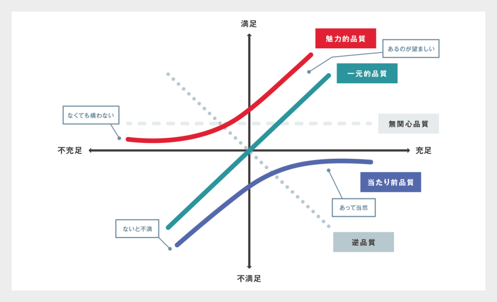

### ✅ フロート（Float）

- **別名：スラック（Slack）**
- プロジェクトスケジュールにおいて、**アクティビティ（作業）を遅らせても全体のスケジュールに影響を与えない余裕時間**のこと。
- 例：ある作業を2日遅らせても後続作業に影響がなければ、その作業のフロートは「2日」。

---

### ✅ リスク登録簿（Risk Register）

- プロジェクト中に予測される「**リスク（起こるかもしれない不確実な事象）**」を一覧でまとめた記録表。
- 通常、次の情報を含む：  
  - リスク内容  
  - 発生原因  
  - 影響範囲（コスト、スケジュールなど）  
  - 優先度  
  - 対応策（例：回避、緩和、転嫁、受容）

---

### ✅ プランニング・ポーカー（Planning Poker）

- **アジャイル開発（Scrum）で使われる見積もり手法**のひとつ。
- 各メンバーが作業の難易度や工数を**トランプのようなカード（数値）で見積もる**。
- チーム全員で意見を出し合いながら見積もりの妥当性を判断する。

---

### ✅ DfX（Design for X）

- 「X」は「信頼性（Reliability）」「保守性（Maintainability）」「製造性（Manufacturability）」などの特定目的を表す。
- つまり、**ある品質や特性を最初から意識して設計する考え方**。
- 例：「Design for Cost（コストを意識した設計）」など。

---

### ✅ 狩野モデル（Kano Model）

- **製品やサービスの品質と顧客満足の関係を分類するモデル**。
- 機能を3つに分類：
  - **基本的品質**（満たされないと不満になる）
  - **期待品質**（満たされれば満足、なくても不満にはならない）
  - **魅力的品質**（予想外で感動する）

---

### ✅ リスク・アセスメント（Risk Assessment）

- プロジェクトにおけるリスクを**識別・分析・優先順位付けする一連のプロセス**。
- 一般的には以下の2段階で行う：
  1. **定性的リスク分析**（影響度や発生確率を主観的に評価）
  2. **定量的リスク分析**（数値的にリスク影響を評価）

---

### ✅ コンフリクト（Conflict）

- チーム内外の**対立や衝突**のこと。
- 例：目標の違い、役割の重複、リソースの取り合いなど。
- プロジェクト・マネジャーは、**コンフリクト・マネジメント手法**を使って解決を図る。

---

### ✅ PIマトリクス（PI Matrix）

- 「**Prioritization Index Matrix**」の略。
- 複数のリスク・課題・要望などを、**重要度や緊急度に基づいて優先順位づけするためのツール**。
- Excelやホワイトボード上で、「影響度 × 発生確率」などの軸で整理されることが多い。

---

### ✅ プロダクト・バックログ
プロダクト・バックログ（Product Backlog）とは、  
プロダクトを完成させるために必要とされる **すべての機能** や **作業項目** を、**優先順位** を付けて一覧化したものです。  

- **誰が管理するか**  
  プロダクト・オーナーが作成し、優先順位の付け替えや項目の追加・削除を行います。   

- **いつ更新するか**  
  プロジェクト全期間を通じて変化し続けます。新たな要件が出ればバックログに追加し、完了した項目は削除します。   

- **どう表現するか**  
  特定の書式はありませんが、一般的には「ユーザー・ストーリー」の形式で記述します：  
  > 「〜として（立場）、〜ができる（機能）、なぜなら〜だから（理由）」   

- **なぜ必要か**  
  項目の重要度を可視化することで、限られた期間・リソースの中でどこから手をつけるべきかをチーム全体で共有し、価値の高い順に機能を提供できるようにするためです。  

**関連用語**  
- **スプリント（イテレーション）・バックログ**  
  「今スプリントで着手するプロダクト・バックログ項目」をチームが選び出し、タスクレベルに分解したもの。 citeturn5file0  
- **バックログのリファインメント（グルーミング）**  
  定期的にバックログ項目を見直し、記述を洗練したり優先順位を更新したりする活動。   

| バックログ種別 | 範囲                                  | 作成・管理者        | 更新タイミング                                   |
| ------------- | ------------------------------------ | ------------------- | ---------------------------------------------- |
| プロダクト   | 製品／システム全体で必要なすべての項目 | プロダクト・オーナー | プロジェクト全期間を通じて随時                    |
| スプリント   | 当該スプリント内に完了させる項目       | 開発チーム全体      | 各スプリント開始前のスプリント計画ミーティング時|

  ---
